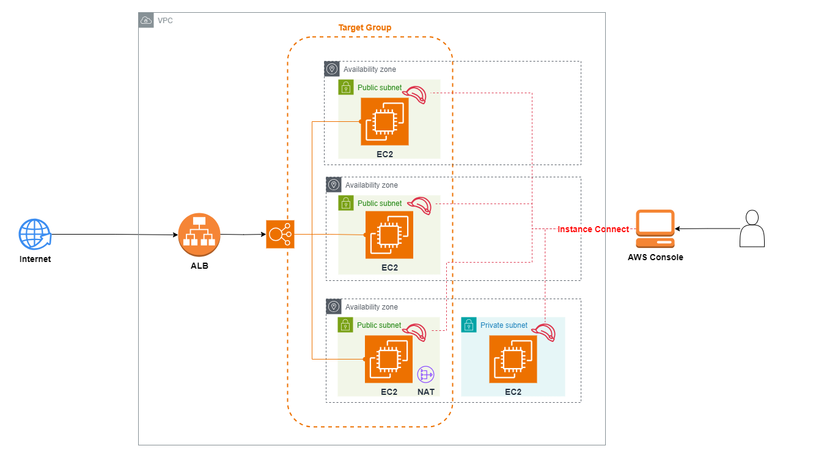

# 架構圖 Architecture Design


# 專案說明 Projecy Desctiption
--------------------*中文版*--------------------

本專案旨在使用 Terraform 在 AWS 上自動化部署一個包含 Application Load Balancer (ALB)、EC2 和 VPC 的雲端架構。透過 ALB 的 DNS，使用者可以觀察網頁流量的分散處理，並在 EC2 實例上配置 NGINX 伺服器來展示網頁內容。

此架構透過多個可用區 (Availability Zone) 部署，具備高度可用性與擴展性，並利用 ALB 來分散網頁流量。具體架構如下：

- **VPC**: 專用的虛擬私有雲，用於隔離和保護 AWS 資源。
- **ALB (Application Load Balancer)**: 用於將來自網際網路的流量分散至多個 EC2 實例。
- **EC2 實例**: 部署於不同的可用區中，並配置了 NGINX 伺服器來展示靜態網頁內容。
- **Public 和 Private Subnet**: Public subnet 用於託管 EC2 和 NAT Gateway，Private subnet 則用於內部 EC2 實例的通訊。
- **NAT Gateway**: 提供 Private Subnet 中的 EC2 實例與外部網路的出站流量。

--------------------*English Version*--------------------

This project aims to automate the deployment of a cloud architecture on AWS using Terraform, which includes an Application Load Balancer (ALB), EC2 instances, and a VPC. Through the DNS of the ALB, users can observe the distribution of web traffic, and the EC2 instances are configured with an NGINX server to display web content.

This architecture is deployed across multiple Availability Zones, ensuring high availability and scalability, and utilizes the ALB to distribute traffic. The detailed architecture is as follows:

- **VPC**: A dedicated Virtual Private Cloud used to isolate and protect AWS resources.
- **ALB (Application Load Balancer)**: Used to distribute incoming internet traffic to multiple EC2 instances.
- **EC2 instances**: Deployed across different Availability Zones, with an NGINX server configured to display static web content.
- **Public and Private Subnets**: The public subnet is used to host EC2 and NAT Gateway, while the private subnet is for internal EC2 instance communication.
- **NAT Gateway**: Provides outbound internet access for EC2 instances in the private subnet.

# 使用步驟 Steps
--------------------*中文版*--------------------

## 1. 使用前配置
- **IAM 用戶與 AWS CLI 配置：**
  - 在 AWS 上建立一個帶有 `access key` 的 IAM user，該用戶應有足夠的權限管理 EC2、S3 和 VPC。
  - 下載並安裝 [AWS CLI](https://aws.amazon.com/cli/)。
  - 使用 `aws configure` 命令將 IAM user 的 profile 設置在本地環境中。

## 2. 修改 Terraform 配置檔案
進入專案目錄，並依照以下步驟設定 Terraform 配置檔案：

1. **進入 `_variable.tf` 檔案：**
   - 設定 `provider "aws"`， 指定 IAM user 的 profile，並輸入 AWS 的 `region`。
   - 輸入適合的標籤名稱（tag names）來協助資源管理。

2. **檢查 EC2 的 AMI 設定：**
   - 確認會使用到的 AMI ID，這些 AMI 會根據你所選擇的 region 而不同。這一點非常重要，因為不同地區有不同的 AMI 可供選擇。
   - 在 `EC2.tf` 中確認每台 EC2 實例都配置了合適的 AMI ID。

## 3. 執行 Terraform 指令
在完成所有設定後，可以按照以下順序執行 Terraform 指令來部署架構：

1. **初始化 Terraform 環境：**
   ```bash
   terraform init
   ```
   該命令會下載並安裝 AWS Provider，並初始化 Terraform 環境。

2. **驗證配置：**
   ```bash
   terraform validate
   ```
   確認你的 Terraform 配置文件語法正確且無誤。

3. **計劃變更：**
   ```bash
   terraform plan
   ```
   該命令會生成變更計劃，幫助你確認哪些資源將會被創建或修改。

4. **應用變更：**
   ```bash
   terraform apply
   ```
   該命令會開始創建並部署所有 AWS 資源。運行後會提示輸入 `yes` 確認變更。

## 4. 測試完成後刪除資源
當測試結束後，為了避免不必要的資源消耗，你可以刪除所有已創建的資源：

```bash
terraform destroy
```
該命令會刪除所有由 Terraform 創建的資源，確保測試環境被完全移除。

--------------------*English Version*--------------------

## 1. Pre-Configuration
- **IAM User and AWS CLI Configuration:**
  - Create an IAM user with an `access key` in AWS, select user profile of IAM, and ensure the user has sufficient permissions to manage EC2, S3, and VPC.
  - Download and install [AWS CLI](https://aws.amazon.com/cli/).
  - Use the `aws configure` command to set the IAM user's profile in your local environment.

## 2. Modify Terraform Configuration Files
Navigate to the project directory and follow these steps to configure the Terraform files:

1. **Edit the `_variable.tf` file:**
   - Set the `provider "aws"` and input the desired AWS `region`.
   - Input appropriate tag names to assist with resource management.
   - Specify the name of the S3 bucket.

2. **Check EC2 AMI Settings:**
   - Verify the AMI ID to be used, as these AMIs vary depending on the selected region. This step is crucial because different regions have different AMIs available.
   - Confirm that each EC2 instance in `EC2.tf` is configured with the correct AMI ID.

## 3. Execute Terraform Commands
After completing all the configurations, you can deploy the architecture by following these steps:

1. **Initialize the Terraform Environment:**
   ```bash
   terraform init
   ```
   This command will download and install the AWS Provider and initialize the Terraform environment.

2. **Validate the Configuration:**
   ```bash
   terraform validate
   ```
   This command checks that your Terraform configuration files are syntactically correct and valid.

3. **Plan the Changes:**
   ```bash
   terraform plan
   ```
   This command generates an execution plan to help you review the resources that will be created or modified.

4. **Apply the Changes:**
   ```bash
   terraform apply
   ```
   This command will start creating and deploying all AWS resources. You will be prompted to type `yes` to confirm the changes.

## 4. Clean Up After Testing
Once testing is complete, you can remove all created resources to avoid unnecessary costs:

```bash
terraform destroy
```
This command will delete all resources created by Terraform, ensuring the test environment is completely removed.
```

This version translates the content into English while preserving the technical instructions and flow.